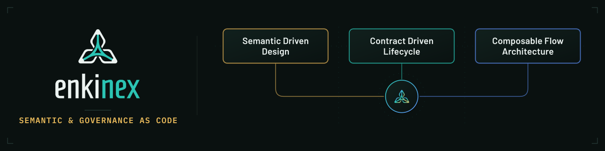

# Enkinex Ossie — Apache Ossie as Code Library

> A modular [KCL](https://www.kcl-lang.io/) library for the
> [Apache Ossie Core Metadata Specification 0.2.0.dev0](https://github.com/apache/ossie),
> built to author, type-check, and validate Apache Ossie semantic model definitions.

## Project Summary

"Apache Ossie is a collaborative, open-source effort dedicated to standardizing and streamlining semantic model exchange and utilization across the diverse array of tools and platforms within the data analytics, AI, and BI ecosystem."

## Contributing

Contributions are welcome — see [CONTRIBUTING.md](CONTRIBUTING.md) and the
contributor list in [AUTHORS.md](AUTHORS.md). This project follows the
[Code of Conduct](CODE_OF_CONDUCT.md); to report a security issue, see
[SECURITY.md](SECURITY.md).

## License

Licensed under the terms in [LICENSE](LICENSE).
